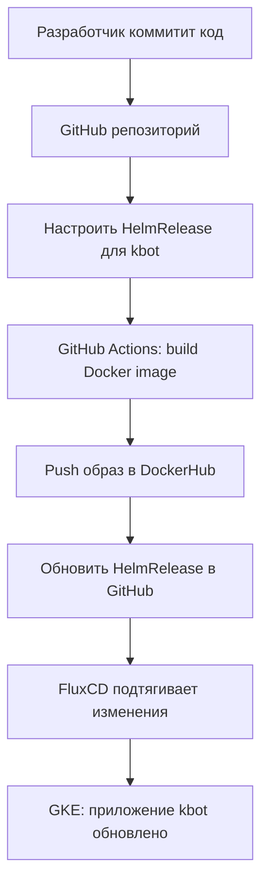

# README.md


## 1. Что нужно сделать (Flowchart)





## 2. Как это работает (Sequence diagram)


```mermaid
sequenceDiagram
participant Dev as Developer
participant GH as GitHub
participant Actions as GitHub Actions
participant Docker as DockerHub
participant Flux as FluxCD
participant GKE as GKE Cluster


Dev->>GH: Push code / HelmRelease changes
GH->>Actions: Trigger workflow
Actions->>Docker: Build & push Docker image
Actions->>GH: Update HelmRelease with new image tag
GH->>Flux: Commit new HelmRelease
Flux->>GKE: Apply manifests
Docker->>GKE: Provide image for Deployment
GKE-->>Dev: kbot app updated